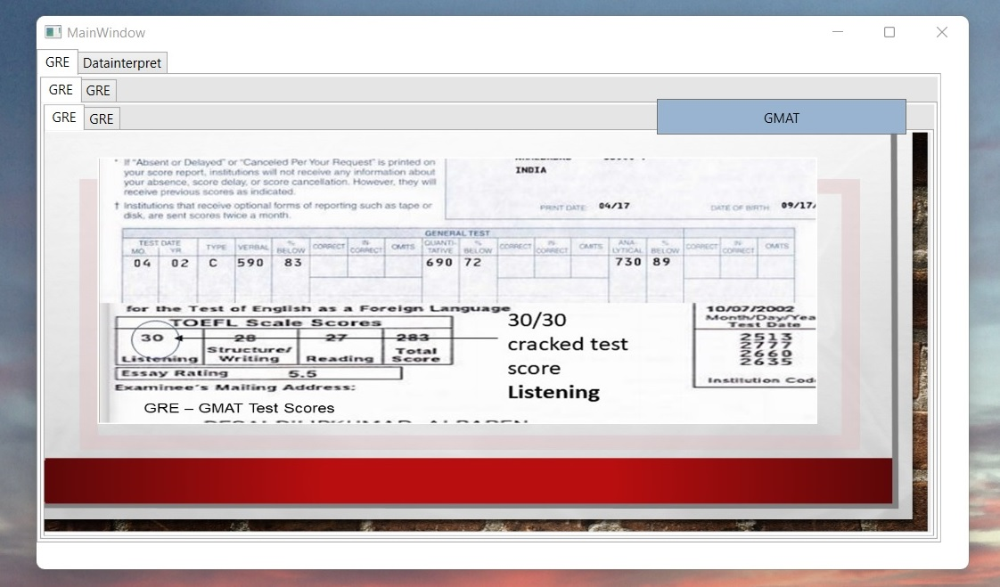
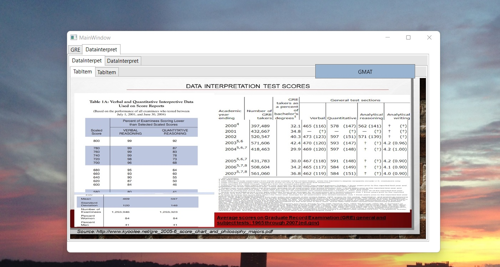
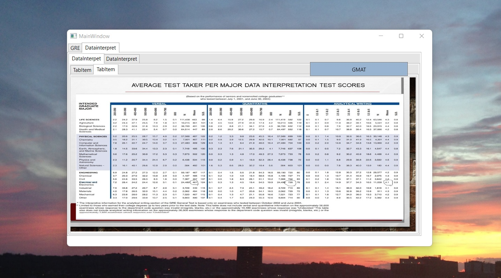
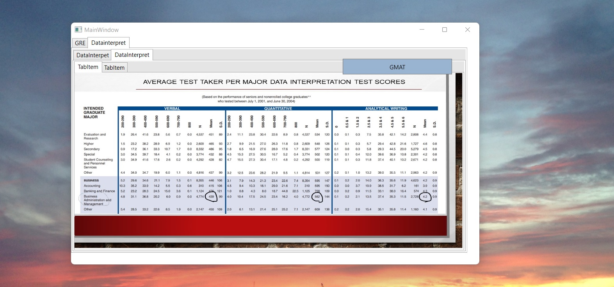
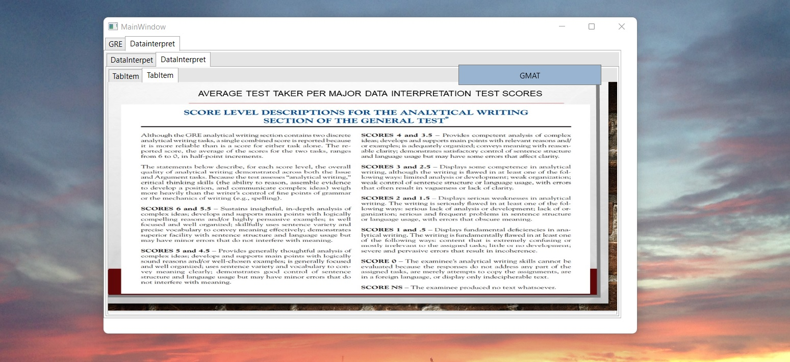

# Test Scores

The project provides data interpretation of GRE and GMAT test scores based on my test scores. Confidential information is not displayed. Please download the executable in https://github.com/alpaddesai/TestScores/releases for details. All images are either custom by Alpa D Desai or a reference source is provided.

## GRE

#### 2003 total test takers 571,606

## GRE

 #### Mean Verbal 469, Mean Quant is 597

## GRE

#### EE Mean Verbal 461, Computer Science Mean Verbal 469
#### EE Mean Quant 728, Computer Science Mean Quant 704

## GRE

## GRE

Additional details reference :  https://github.com/alpaddesai/RankCertificatesUndergraduateDegree and https://github.com/alpaddesai/MedicalDevices.
